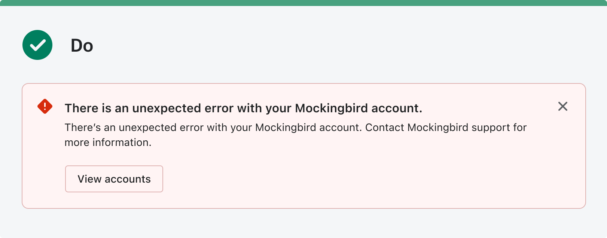
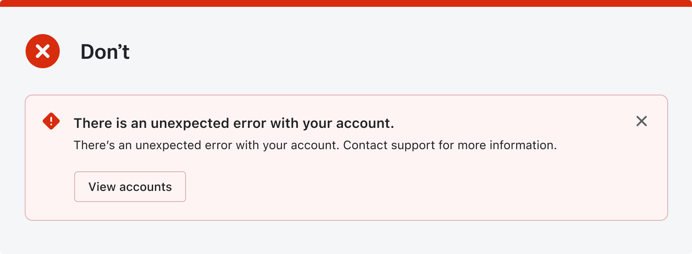
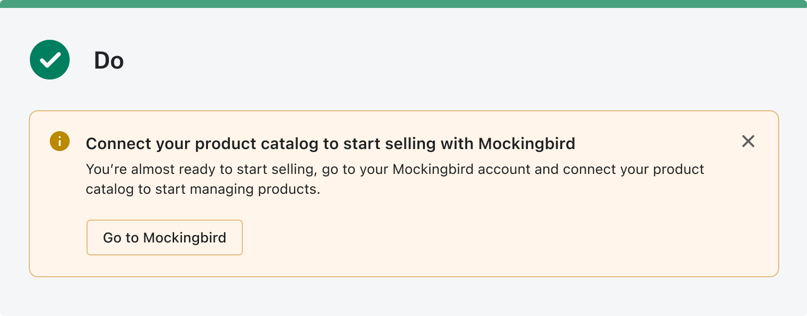
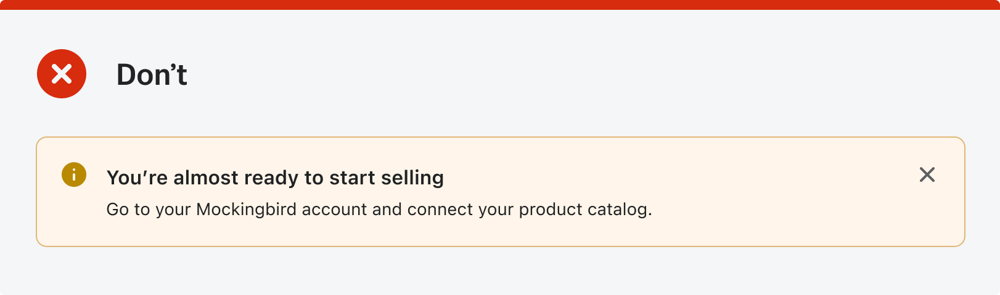
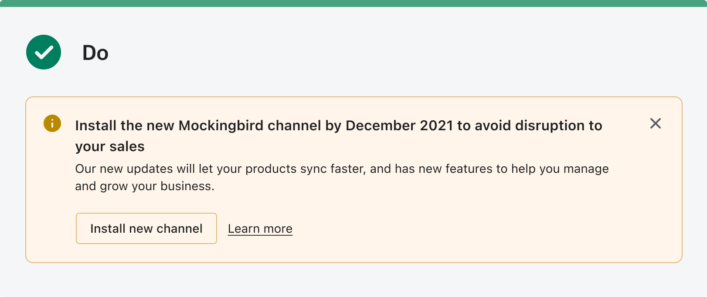
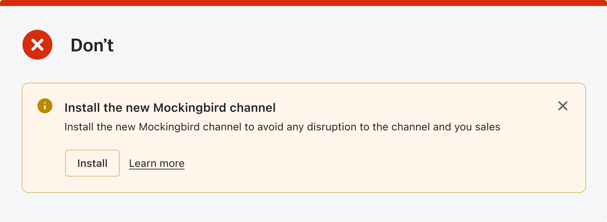

# Content guidelines

We know that your platform has its own voice and tone, and it’s ok to preserve them in the channel. However, channels are part of Shopify and merchants don’t see them as a separate experience.

When you’re creating content for a sales channel, use Shopify’s [voice and tone guide](https://polaris.shopify.com/content/voice-and-tone) to validate your decisions.

> Note
>
> > When building the channel, use the names of features you have on your platform without altering, so that merchants can recognize them when they leave Shopify admin and use your platform. 

---

## Specific content use cases

Channels are a bridge between Shopify and your platform. To communicate correctly, you might require unique messaging and patterns that will differ from what merchants are used to seeing in Shopify. That’s okay.

---

## Communicating external errors

When merchants run into errors that are caused by something out of Shopify’s control, this is how you can communicate it.

|                                                                                               |                                                                                                     |
| --------------------------------------------------------------------------------------------- | --------------------------------------------------------------------------------------------------- |
|  |  |

**Best practices:**

1. Make it clear that the issue requires contacting specialists on your platform.
2. Provide an easy way for merchants to contact you.
3. Be as clear as possible about what happened.

---

## Action required outside of Shopify

While merchants are setting up their channel they may need to take an action outside of Shopify. Make sure to be as clear as possible outlining merchant’s next steps.

|                                                                                                                         |                                                                                                                               |
| ----------------------------------------------------------------------------------------------------------------------- | ----------------------------------------------------------------------------------------------------------------------------- |
|  |  |

**Best practices:**

1. Tell merchants where they need to go to resolve the issue, and be clear about when they are leaving Shopify
2. Provide a direct link or guide them
3. Tell merchants what they need to do after they leave Shopify

---

## Important channel updates

If there are new requirements for your channel or important information that merchants need to know, communicate them as early and as directly as possible. Mention the impact on the merchant’s store or sales, if any. Don’t rely on email or external communication, as merchants often miss it.

|                                                                                           |                                                                                                 |
| ----------------------------------------------------------------------------------------- | ----------------------------------------------------------------------------------------------- |
|  |  |

**Best practices:**

1. Tell the merchants if any action is required of them
2. When possible, add a relevant date or time
3. Let merchants know how long this announcement may affect them and if there are any consequences
4. If there’s ever impact on their store or sales, be upfront
5. Link to a solution or provide documentation on the change
