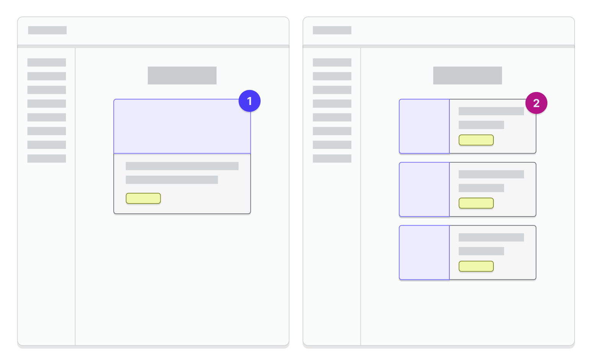
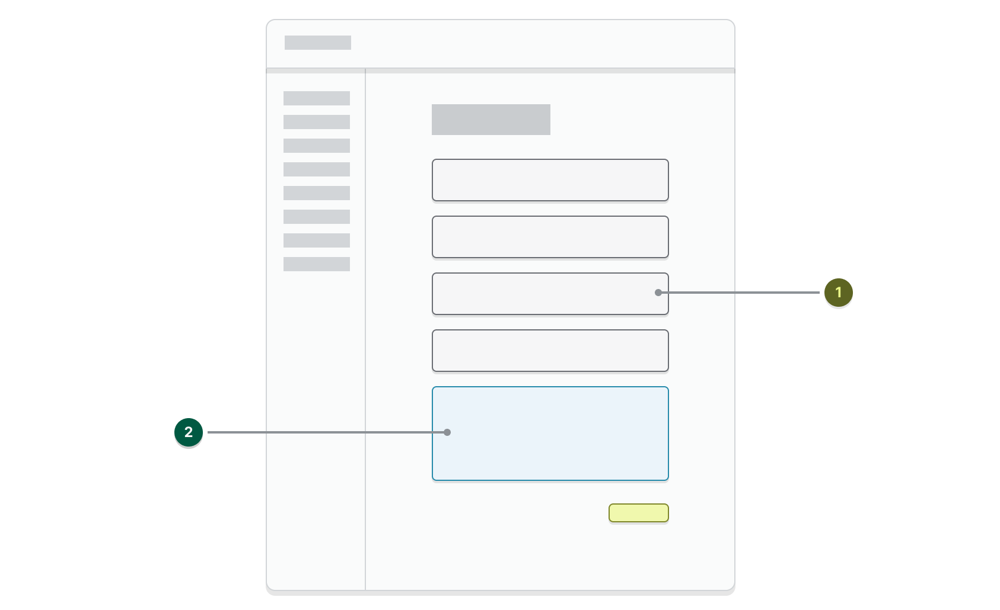
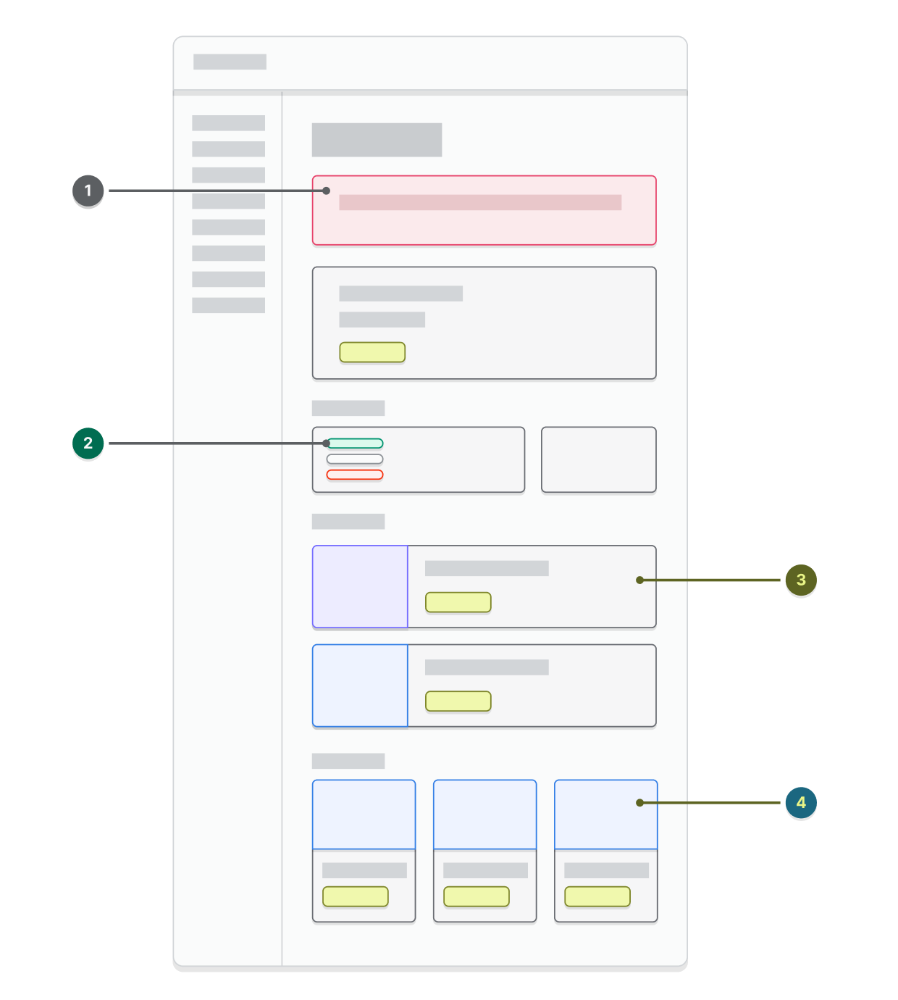

# Using Channels UI

Shopify Channels UI is available as a JavaScript module on npm. To install in in your app, you can use [npm](https://docs.npmjs.com/getting-started) or [yarn](https://classic.yarnpkg.com/en/).

```bash
yarn add @shopify/channels-ui
```

or

```bash
npm install --save @shopify/channels-ui
```

Shopify Channels UI offers a set of React components for use in your app, in addition to those provided by [Shopify Polaris](https://polaris.shopify.com/components/get-started). This is a great option if you are building your app in React and want to follow Shopify's channel best practices.

## Getting started

> In the following example, you need to store shopOrigin during the authentication process and then retrieve it for the code to work properly. To learn more about this process, see [Getting and storing the shop origin](https://shopify.dev/apps/auth/oauth).

To use the React components you need to wrap your React app in the `ExtendedAppProvider` provided by Channels UI. This also adds the [Polaris App Provider](https://polaris.shopify.com/components/structure/app-provider), and [App Bridge Provider](https://shopify.dev/apps/tools/app-bridge/react-components/provider), so you do not need to add these providers again. Only one `ExtendedAppProvider` is needed for your application.

```javascript
import React from 'react';
import ReactDOM from 'react-dom';
import {ExtendedAppProvider} from '@shopify/channels-ui';
import polarisTranslations from '@shopify/polaris/locales/en.json';
import channelsUiTranslations from '@shopify/channels-ui/locales/en.json';

function MyApp() {
  const appBridgeConfig = {
    apiKey: 'API key from Shopify Partner Dashboard',
    host: 'host from URL search parameter',
    forceRedirect: true,
  };

  return (
    <ExtendedAppProvider
      config={appBridgeConfig}
      polaris={{i18n: polarisTranslations}}
      i18n={channelsUiTranslations}
    >
      /* your app */
    </ExtendedAppProvider>
  );
}

const root = document.createElement('div');
document.body.appendChild(root);
ReactDOM.render(<MyApp />, root);
```

The `polaris` prop is an object that accepts all props from the [Polaris App Provider](https://polaris.shopify.com/components/structure/app-provider)

> The tutorial above uses English locale files, but you can import other locales from Polaris and Channels UI depending on what language you want to display to the merchant.

## Introduction Page

The introduction page is the welcome screen of a channel. Its main goal is to help a merchant understand the value of the channel and choose the right starting point.



1. Single-feature channel
2. Channel with multiple features

The structure of the page depends on the number of features a channel has to offer. A feature is a tool you offer merchants to interact with and succeed on your platform (ex. Paid Ads, Organic Listings, Web Checkout).

Here is an example of a simple introduction page if your channel only has a single feature. The Feature Card's `children` should provide a visual representation of the feature the merchant is onboarding onto, or can surface your platform's brand.

```javascript
import React from 'react';
import {IntroductionPage, FeatureCard} from '@shopify/channels-ui';

export default function MyIntroductionPage() {
  const handleAction = () => {
    // redirect merchants to the onboarding page for the feature
  };

  return (
    <IntroductionPage title="Get started with the Mockingbird channel">
      <FeatureCard
        title="Sell your products on Mockingbird"
        feature="Mockingbird Shopping"
        portrait
        description="Let customers discover and purchase your products directly on Mockingbird."
        badgeText="Free"
        primaryAction={{
          content: 'Start setup',
          onAction: handleAction,
        }}
      >
        
      </FeatureCard>
    </IntroductionPage>
  );
}
```

## Onboarding Page

An onboarding page contains a sequence of steps a merchant needs to complete to set up a feature. This process is crucial to a merchant's success, so make sure you present channel requirements and other relevant information up-front if applicable.



1. Completed onboarding steps
2. Current or active step

Here is an example of a simple onboarding page containing account connection and terms acceptance steps.

> You can choose to leverage your platform's native authentication flow or build the login page directly into the channel via an embedded modal.

```javascript
import React, {useState} from 'react';
import {
  OnboardingPage,
  OnboardingCard,
  AccountConnection,
} from '@shopify/channels-ui';
import {Stack, Button, Link} from '@shopify/polaris';

export default function MyOnboardingPage() {
  // setup states to track user completion for this example
  // onboarding completion should be tracked in your database
  const [accountConnected, setAccountConnected] = useState(false);
  const [termsAccepted, setTermsAccepted] = useState(false);

  const handleBreadcrumbAction = () => {
    // redirect merchant to introduction page
  };

  const handleAccountConnect = () => {
    // surface your platform's authentication in a modal or popup
    setAccountConnected(true);
  };

  const handleAccountDisconnect = () => {
    // disconnect account in your database
    setAccountConnected(false);
    setTermsAccepted(false);
  };

  const handleTermsAccept = () => {
    // persist that the terms are accepted in your database
    setTermsAccepted(true);
  };

  const handleFinishSetup = () => {
    // persist that the onboarding is complete in your database
    // redirect merchant to overview page
  };

  // setup state of the onboarding steps
  const accountState = accountConnected ? 'completed' : 'active';
  let termsState = 'disabled';
  if (accountConnected && !termsAccepted) {
    termsState = 'active';
  } else if (termsAccepted) {
    termsState = 'completed';
  }

  // set AccountConnection props based on whether an account has been connected
  const accountConnectionProps = accountConnected
    ? {
        content: 'example@mockingbird.com', // an identifier for the account on your platform
        avatar:
          'https://burst.shopifycdn.com/photos/fashion-model-in-fur.jpg?width=373', // thumbnail representation of the account on your platform (optional)
        action: {
          content: 'Disconnect',
          onAction: handleAccountDisconnect,
        },
        connected: true,
      }
    : {
        content: 'No account connected',
        action: {
          content: 'Connect account',
          onAction: handleAccountConnect,
        },
        connected: false,
      };

  return (
    <OnboardingPage
      title="Set up Mockingbird Shopping"
      breadcrumb={{
        onAction: handleBreadcrumbAction,
      }}
      action={{
        content: 'Finish setup',
        disabled: !termsAccepted,
        onAction: handleFinishSetup,
      }}
    >
      <OnboardingCard
        id="account-connection"
        title="Connect your Mockingbird account"
        state={accountState}
        footer="This account is needed to sync your products to Mockingbird"
      >
        <AccountConnection {...accountConnectionProps} />
      </OnboardingCard>
      <OnboardingCard
        id="terms"
        title="Accept the terms of service"
        state={termsState}
        sectioned
      >
        <Stack vertical>
          <p>
            In order to complete set up, you need to read and agree to{' '}
            <Link>Mockingbird Merchant Terms of Service</Link> and{' '}
            <Link>Mockingbird Shopping Terms of Service</Link>
          </p>
          <Stack distribution="trailing">
            <Button primary onClick={handleTermsAccept}>
              Accept
            </Button>
          </Stack>
        </Stack>
      </OnboardingCard>
    </OnboardingPage>
  );
}
```

## Overview Page

The goal of the overview page is to serve as a channel’s home page. It gives merchants a central place for management, discovery, and education to help them succeed with the channel. This page should be displayed instead of the introduction page once a merchant has onboarded onto their first feature.



1. Informational banner
2. Product status details
3. Available channel features
4. Resources and tutorials 

### Product Sync Section

This component gives merchants an overview of their products and their status on the channel. It should also provide a link to the bulk editor so merchants can easily manage which products they make available to your channel. If your channel has product requirements, merchants should be able to quickly glance at the card and understand how many products are in good standing, versus requiring additional attention to get them successfully synced onto the channel.

The publication id for your channel can be fetched via the GraphQL Admin API's `currentAppInstallation` > `publication` [field](https://shopify.dev/api/admin/graphql/reference/apps/appinstallation#publication).

```graphql
query {
  currentAppInstallation {
    publication {
      id
    }
  }
}
```

```json
{
  "currentAppInstallation": {
    "publication": {
      "id": "gid://shopify/Publication/1"
    }
  }
}
```

The [ProductListing API](https://shopify.dev/api/admin/rest/reference/sales-channels/productlisting#count-2021-07) can be used to get the number of products published to your app.

### Feature List Card

This card is an overview of all the features that the merchant has onboarded to or started to onboard. It’s an easily digestible list of features with relevant statuses, descriptions, and actions available to merchants.

Here is an example of a simple overview page for a channel with a single feature.

```javascript
import React from 'react';
import {
  OverviewPage,
  ProductSyncSection,
  FeatureListCard,
} from '@shopify/channels-ui';

export default function MyOverviewPage() {
  // the number of products publication to your app's
  const availableProductCount = 22;

  // the id of your app's publication
  const publicationId = 72112898104;

  // current shop domain
  const shopOrigin = 'test.myshopify.com';

  return (
    <OverviewPage title="Mockingbird channel overview">
      <OverviewPage.Section title="Product status on Mockingbird">
        <ProductSyncSection
          summary={`${availableProductCount} products are available to the Mockingbird channel`}
          manageAction={{
            content: 'Manage availability',
            external: true,
            url: `https://${shopOrigin}/admin/bulk?resource_name=Product&edit=publications.${publicationId}.published_at`,
          }}
          productStatuses={[
            {
              badge: {
                status: 'success',
                children: 'Approved',
              },
              label: `${availableProductCount} products`,
            },
          ]}
        />
      </OverviewPage.Section>
      <OverviewPage.Section title="Manage your Mockingbird Features">
        <FeatureListCard
          features={[
            {
              title: 'Mockingbird Shopping',
              description:
                'Let customers discover and purchase your products directly on Mockingbird.',
              badge: {
                status: 'success',
                children: 'Active',
              },
              action: {
                content: 'View shop',
              },
            },
          ]}
        />
      </OverviewPage.Section>
    </OverviewPage>
  );
}
```

## Settings Page

After merchants onboard onto your channel, they will be able to access their accounts and other settings related to the channel on the settings page. 


1. Simple settings with in one page
2. Complex settings with multiple pages in tabs

Here is an example of a simple settings page that allows the merchant to connect/disconnect their account.

```javascript
import React, {useState} from 'react';
import {SettingsPage, AccountConnection} from '@shopify/channels-ui';
import {Card} from '@shopify/polaris';

export default function MySettingsPage() {
  // setup states to track account connection for this example
  // account connection status and details should come from your database
  const [accountConnected, setAccountConnected] = useState(true);

  const handleAccountConnect = () => {
    // surface your platform's authentication in a modal or popup
    setAccountConnected(true);
  };

  const handleAccountDisconnect = () => {
    // disconnect account in your database
    setAccountConnected(false);
  };

  // set AccountConnection props based on whether an account is connected
  const accountConnectionProps = accountConnected
    ? {
        content: 'example@mockingbird.com',
        avatarUrl:
          'https://burst.shopifycdn.com/photos/fashion-model-in-fur.jpg?width=373',
        action: {
          content: 'Disconnect',
          onAction: handleAccountDisconnect,
        },
        connected: true,
      }
    : {
        content: 'No account connected',
        action: {
          content: 'Connect',
          onAction: handleAccountConnect,
        },
        connected: false,
      };

  return (
    <SettingsPage title="Settings">
      <SettingsPage.Section
        title="Account"
        description="Your Shopify products are synced with this Mockingbird Account"
      >
        <Card>
          <AccountConnection {...accountConnectionProps} />
        </Card>
      </SettingsPage.Section>
    </SettingsPage>
  );
}
```
